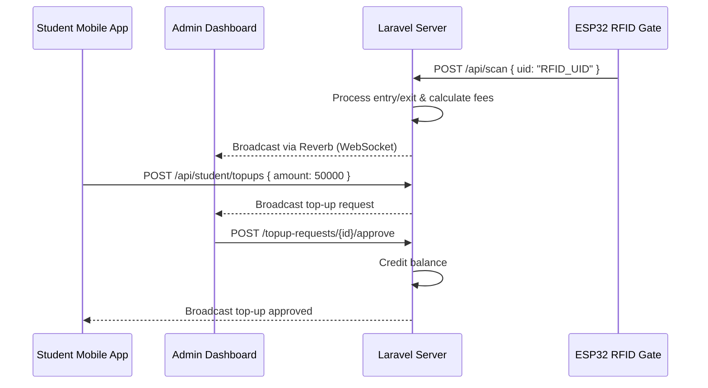

# Smart Parking IoT System 

An operational Laravel 13 smart parking system designed with an IoT integration (ESP32 RFID reader, thermal printing, and gate screen), extended with a **Student Role**, **Mobile API**, and **Top-Up Approval Workflow**.

---

## 🚀 Key Features

*   **RFID Entry & Exit:** Automatic detection of vehicle entry and exit with gate screen display.
*   **Role-Based Management:** Core roles: `admin`, `display`, and the newly created `student`.
*   **Sanctum-Based Mobile API:** Secure endpoint group for the student mobile client application.
*   **Balance Top-Up Workflow:** Student-initiated mobile requests that admins approve/reject with real-time updates.
*   **IoT & Thermal Printer Integration:** Configurable print modes (`windows` / `file` / `disabled`) and hardware status indicators.
*   **Real-time Broadcasting:** Powered by Laravel Reverb for real-time table refreshing and toast notifications.

---

## 🛠️ Hardware & Architecture

### Hardware Components
1.  **ESP32 Microcontroller:** Connected via Wi-Fi to the Laravel backend.
2.  **MFRC522 RFID Reader:** Tapped at entry/exit gates to scan cards.
3.  **ESC/POS Thermal Printer:** Prints tickets (Entry ticket / Exit invoice).

### System Data Flow


---

## 📦 Installation & Setup

### Requirements
*   PHP >= 8.2 (configured with standard extensions)
*   Composer
*   Node.js & NPM
*   MySQL / MariaDB
*   Laravel Reverb (included in Laravel 13)

### Steps

1.  **Clone the Repository & Install Dependencies:**
    ```bash
    composer install
    npm install
    ```

2.  **Environment Setup:**
    Create a `.env` file from `.env.example` and set up the following keys:
    ```ini
    DB_CONNECTION=mysql
    DB_HOST=127.0.0.1
    DB_PORT=3306
    DB_DATABASE=parking_sistem
    DB_USERNAME=root
    DB_PASSWORD=
    
    BROADCAST_CONNECTION=reverb
    
    REVERB_APP_ID=708938
    REVERB_APP_KEY=olnqyyzbxmvpdvburjew
    REVERB_APP_SECRET=ksmqpaaybayjqhxbzud8
    REVERB_HOST="localhost"
    REVERB_PORT=8080
    REVERB_SCHEME=http
    
    VITE_REVERB_APP_KEY="${REVERB_APP_KEY}"
    VITE_REVERB_HOST="${REVERB_HOST}"
    VITE_REVERB_PORT="${REVERB_PORT}"
    VITE_REVERB_SCHEME="${VITE_REVERB_SCHEME}"
    
    # Printer Configuration
    PARKING_PRINTER_NAME=POS-58
    PARKING_PRINT_MODE=file # Use 'file' for testing, 'windows' for production, or 'disabled'
    PARKING_DEFAULT_BALANCE=100000
    PARKING_FIRST_HOUR_COST=2000
    PARKING_NEXT_HOUR_COST=1000
    ```

3.  **Run Migrations:**
    ```bash
    php artisan migrate
    ```

4.  **Build Assets:**
    ```bash
    npm run build
    # Or start Vite dev server
    npm run dev
    ```

5.  **Start Services:**
    *   **Laravel App Server:** `php artisan serve`
    *   **Reverb Broadcast Server:** `php artisan reverb:start`

---

## 📖 Mobile API Documentation

All Mobile API endpoints are prefixed with `/api`. Authenticated endpoints require a Sanctum Bearer token:
`Authorization: Bearer <your_personal_access_token>`

### 🔑 Authentication

#### 1. Student Login
*   **Endpoint:** `POST /api/student/login`
*   **Request Body:**
    ```json
    {
      "npm": "24783072",
      "password": "yourpassword"
    }
    ```
*   **Response (200 OK):**
    ```json
    {
      "status": "success",
      "message": "Login berhasil.",
      "token": "1|abcdefghijklmnopqrstuvwxyz...",
      "student": {
        "id": 5,
        "name": "Jane Doe",
        "npm": "24783072",
        "balance": 100000,
        "rfid_uid": "ABC12345",
        "plate_number": "BE 1234 AB",
        "vehicle_type": "motor"
      }
    }
    ```

#### 2. Student Logout
*   **Endpoint:** `POST /api/student/logout`
*   **Headers:** `Authorization: Bearer <token>`
*   **Response (200 OK):**
    ```json
    {
      "status": "success",
      "message": "Logout berhasil."
    }
    ```

---

### 👤 Student Profile & History

#### 3. View Student Profile
*   **Endpoint:** `GET /api/student/profile`
*   **Headers:** `Authorization: Bearer <token>`
*   **Response (200 OK):**
    ```json
    {
      "status": "success",
      "data": {
        "id": 5,
        "name": "Jane Doe",
        "npm": "24783072",
        "balance": 100000,
        "rfid_uid": "ABC12345",
        "rfid_status": "active",
        "plate_number": "BE 1234 AB",
        "vehicle_type": "motor"
      }
    }
    ```

#### 4. Update Student Profile (Name Only)
*   **Endpoint:** `PATCH /api/student/profile` (or `PUT /api/student/profile`)
*   **Headers:** `Authorization: Bearer <token>`, `Content-Type: application/json`
*   **Request Body:**
    ```json
    {
      "name": "Andika Sanddi Pranata"
    }
    ```
*   **Response (200 OK):**
    ```json
    {
      "message": "Nama berhasil diperbarui",
      "data": {
        "profile": {
          "id": 1,
          "name": "Andika Sanddi Pranata",
          "npm": "24783072",
          "rfid_uid": "C6 EF 25 07",
          "rfid_status": "active",
          "plate_number": "BE1234AA",
          "vehicle_type": "Motorcycle"
        }
      }
    }
    ```

#### 4. View Balance
*   **Endpoint:** `GET /api/student/balance`
*   **Headers:** `Authorization: Bearer <token>`
*   **Response (200 OK):**
    ```json
    {
      "balance": 100000
    }
    ```

#### 5. Parking History
*   **Endpoint:** `GET /api/student/parking-history`
*   **Headers:** `Authorization: Bearer <token>`
*   **Query Params (Optional):** `page` (int)
*   **Response (200 OK):**
    ```json
    {
      "current_page": 1,
      "data": [
        {
          "id": 12,
          "entry_time": "2026-06-14 14:00:00",
          "exit_time": "2026-06-14 16:30:00",
          "duration": 3,
          "cost": 4000,
          "status": "OUT"
        }
      ],
      "first_page_url": "http://localhost:8000/api/student/parking-history?page=1",
      "last_page": 1,
      "per_page": 15,
      "total": 1
    }
    ```

#### 6. Transaction History
*   **Endpoint:** `GET /api/student/transactions`
*   **Headers:** `Authorization: Bearer <token>`
*   **Response (200 OK):**
    ```json
    {
      "current_page": 1,
      "data": [
        {
          "id": 8,
          "parking_id": 12,
          "amount": 4000,
          "remaining_balance": 96000,
          "created_at": "2026-06-14 16:30:00"
        }
      ],
      "total": 1
    }
    ```

---

### 💳 Top-Up Requests

#### 7. View Top-Up Request History
*   **Endpoint:** `GET /api/student/topups`
*   **Headers:** `Authorization: Bearer <token>`
*   **Response (200 OK):**
    ```json
    {
      "data": {
        "topups": [
          {
            "id": 15,
            "amount": 50000,
            "status": "pending",
            "payment_proof_url": "http://10.42.26.242:8000/storage/topup-proofs/1/example.jpg",
            "rejection_reason": null,
            "created_at": "2026-06-14T10:30:00+07:00"
          }
        ]
      }
    }
    ```

#### 8. Create Top-Up Request
*   **Endpoint:** `POST /api/student/topups`
*   **Headers:** `Authorization: Bearer <token>`
*   **Content-Type:** `multipart/form-data`
*   **Request Body (Form Data):**
    - `amount`: `50000` (integer, min 1000)
    - `payment_proof`: `[file.jpg/png]` (max 5MB)
*   **Response (201 Created):**
    ```json
    {
      "message": "Permintaan top-up berhasil dikirim",
      "data": {
        "topup": {
          "id": 15,
          "amount": 50000,
          "status": "pending",
          "payment_proof_url": "http://10.42.26.242:8000/storage/topup-proofs/1/example.jpg",
          "created_at": "2026-06-14T10:30:00+07:00"
        }
      }
    }
    ```

---

## 📡 WebSockets Broadcast Channels

Real-time UI updates are broadcasted through Pusher/Reverb protocols on the following channels:

*   `topup-requests-channel`
    *   Event: `.topup-request.created` (a new student top-up request is pending approval)
    *   Event: `.topup-request.approved` (request approved by administrator)
    *   Event: `.topup-request.rejected` (request rejected by administrator)
*   `student-channel`
    *   Event: `.student.created` (admin registers a new student)
*   `gate-screen`
    *   Event: `.scan.result` (provides the latest scanned card `rfid_uid` to autofill/manual override input forms)
